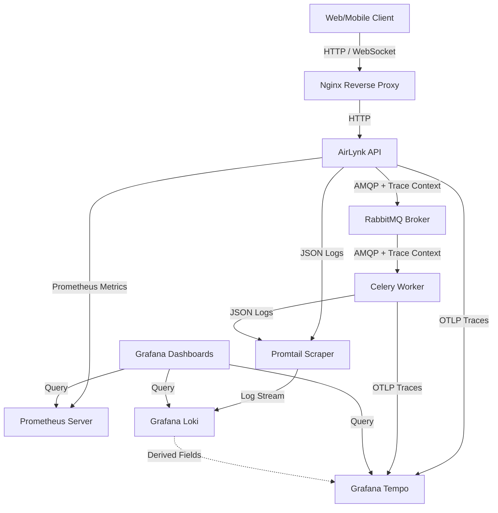

# Observability Topology

```mermaid
graph TD
    Client[Web/Mobile Client] -->|HTTP / WebSocket| Nginx[Nginx Reverse Proxy]
    Nginx -->|HTTP| FastAPI[AirLynk API]
    
    FastAPI -->|OTLP Traces| Tempo[Grafana Tempo]
    FastAPI -->|JSON Logs| Promtail[Promtail Scraper]
    FastAPI -->|Prometheus Metrics| Prometheus[Prometheus Server]
    
    FastAPI -->|AMQP + Trace Context| RabbitMQ[RabbitMQ Broker]
    RabbitMQ -->|AMQP + Trace Context| Celery[Celery Worker]
    
    Celery -->|OTLP Traces| Tempo
    Celery -->|JSON Logs| Promtail
    
    Promtail -->|Log Stream| Loki[Grafana Loki]
    
    Grafana[Grafana Dashboards] -->|Query| Prometheus
    Grafana -->|Query| Loki
    Grafana -->|Query| Tempo
    
    Loki -.->|Derived Fields| Tempo
```
